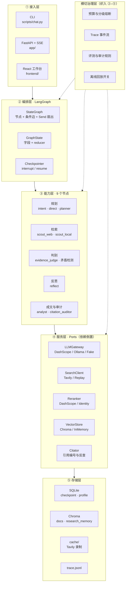

# Attest（质证）架构设计

> 版本 v1.1 · 2026-09-10 · 状态：内部自洽已完成（外部依据分级见《审查报告》H 节）
> 配套《需求分析.md》（FR / NFR）、《功能设计.md》（模块与算法）、《Attest-项目方案.md》v2.4（选型与分期 / §10 工程规范）使用。
> v1.1 变更：§10 不足 2 的"审计器独立验证"从建议落为 P3 末闸门（T3.10）；预算派生值（ADR-02）已同步至方案 §3/§6 与功能设计 §2/§4.2/§6.5。
> 更名说明（2026-09-10）：项目由 Orchestr（灵枢）更名为 **Attest（质证）**，设计与内容未改动。
> 本文档回答"**系统由哪几层构成、依赖往哪个方向流、关键权衡是什么、坏掉时怎么退化**"。

---

## 0. 本文档要证明的一件事

架构的"拿得出手"，不来自层数多、名词新，而来自三点：

1. **依赖方向是单向的**，且能被一句话说清（谁可以依赖谁，谁绝不能依赖谁）
2. **每个关键决策都有明确代价**，并且写明了"什么时候该重新评估"
3. **故障是被设计过的**，不是靠"应该不会出问题"

本文档按这三条组织。凡是做不到这三条的，不进本文档。

---

## 1. 架构总览



---

## 2. 分层职责与依赖方向

**核心原则：依赖只能向下。** 上层可以依赖下层，下层**绝不能反向依赖**上层。

| 层 | 包含 | 职责 | **明确不负责** | 可依赖 |
|---|---|---|---|---|
| ① 接入层 | CLI / FastAPI+SSE / React | 协议适配、请求编排、事件推送 | 任何业务逻辑、任何模型调用 | ② |
| ② 编排层 | StateGraph、GraphState、Checkpointer | 控制流、状态管理、中断与恢复 | 具体业务实现 | ③④ |
| ③ 能力层 | 9 个节点 | 单点业务能力，纯函数式 | 外部 IO 的直接构造、横切治理 | ④ |
| ④ 服务层 | Ports 与 Adapters | 封装一切外部依赖 | 流程决策、状态持久化策略 | ⑤ |
| ⑤ 存储层 | SQLite / Chroma / cache / trace | 数据持久化 | 任何业务判断 | — |
| 横切治理 | 预算 / Trace / 评测 / 回放 | 织入 ②–⑤，不参与依赖链 | 改变业务结果（只降级、只记录） | — |

**这条方向的收益很具体**：因为 ③ 不直接构造外部客户端，所以**任意节点都能脱离网络单测**（NFR-09）；因为 ⑤ 不反向依赖 ②，所以**换存储不影响流程**。

---

## 3. 依赖倒置：端口与适配器

每个外部依赖都是一个 Port（`typing.Protocol`），生产环境与测试环境各有一个 Adapter。

| Port | 生产 Adapter | 测试 Adapter | 这个 Port 存在的**具体理由** |
|---|---|---|---|
| `LLMGateway` | DashScopeAdapter / OllamaAdapter | `FakeLLM`（固定响应 + 可控 token 数） | 熔断要切模型；单测要能断言 token 记账 |
| `SearchClient` | TavilyAdapter | `ReplayAdapter`（读 fixture） | **保护 1000 credits/月 的额度**；让评测可复现 |
| `Reranker` | DashScopeReranker | `IdentityReranker`（原序返回） | 单条 4000 token 超限时要能一键降级 |
| `VectorStore` | ChromaStore | `InMemoryStore` | 单测不碰磁盘；换 Milvus 时只换 Adapter |
| `Citator` | 真实编号器 | 同实现（无 IO） | 引用编号必须可确定性断言 |
| `Clock` / `IdGen` | 系统时钟 | `FrozenClock` | 否则 trace 与引用编号无法写稳定单测 |

> 关键点：**Mock 也是正式的 Adapter，不是补丁。** 因为它是架构的一部分，所以"离线跑通全链路"是能力，而不是临时 hack。

---

## 4. 关键架构决策（ADR）

每条格式统一：**决策 → 背景 → 备选 → 选择与理由 → 代价 → 何时重新评估**。

### ADR-01 · 编排框架选 LangGraph

- **背景**：需要动态扇出、可中断可恢复、循环（补检）三种控制流。
- **备选**：① 自研调度循环；② LangChain AgentExecutor；③ LangGraph。
- **选择**：LangGraph。理由：Send API 提供按数据规模塑形的扇出能力；`interrupt/Command(resume=)` + checkpointer 是唯一开箱即用的持久化人机协同方案。自研要重复实现这三件事，且难验证正确性。
- **代价**：状态合并语义隐含且**并行写入会静默覆盖**，必须靠 reducer 显式声明（见 ADR-02）。
- **重新评估**：若需要跨机器分布式执行，LangGraph 的内存态会成为瓶颈。

### ADR-02 · 预算做成"派生值"，不做成可变状态 ★

- **背景**：预算账户要被所有节点消费，是典型的横切共享状态。
- **备选**：① `budget.spent` 加累加 reducer；② 节点各自写快照；③ **只累加"花费增量"，预算状态由增量派生**。
- **选择**：③。state 中只保留 `cost_incurred: Annotated[float, operator.add]`；`total` 与阈值属静态配置；`fuse_level` 是纯函数 `f(cost_incurred, config)`，随时可算，不手动维护。
- **理由**：备选 ① 虽然可行，但仍有一个可变复合对象在并行分支中流转；③ 把"会被并发写的字段"压缩到一个标量，**从根上消除竞态**，且 `fuse_level` 无法出现"忘记更新"的不一致。
- **代价**：需要所有 LLM 调用都经由网关上报增量——若有人绕过网关直接调 API，记账会漏。
- **重新评估**：若未来引入非 LLM 的计费项（如按次计费的检索），需扩展增量结构。

> 这条**细化并取代**了《功能设计.md》早期关于 `budget.spent` 的写法（该表已同步更新）。

### ADR-03 · 治理横切织入，而非散落在节点里

- **背景**：预算、Trace、审计规则若写在每个节点内部，会污染业务代码，且容易漏。
- **备选**：① 节点内显式调用；② 装饰器 / 中间件织入。
- **选择**：②。记账点收敛在 **LLM 网关**（唯一出口），Trace 事件在**节点执行包装器**统一写入。
- **代价**：多一层间接，调试时要多跳一次；trace 与业务日志可能交错。
- **重新评估**：若某节点需要"不计费"的特殊调用，需要显式豁免机制。

### ADR-04 · 向量库选 Chroma，保留切换能力但不实现

- **背景**：本地 RAG 需要嵌入式向量库，开发机为 Windows。
- **备选**：Milvus Lite（官方不支持 Windows）、Milvus Standalone（需 Docker）、FAISS（无元数据过滤）、Chroma。
- **选择**：Chroma。理由：纯 Python、全平台；且 1.x 核心已 Rust 重写，性能不再是玩具级。统一 `VectorStore` Port，**保留**切 Milvus Standalone 的能力。
- **代价**：`PersistentClient` 不支持多进程并发（SQLite 文件锁）→ 必须单例；默认 embedding 函数会静默下载约 200MB 模型 → 必须显式传向量。
- **重新评估**：向量规模超过百万级，或需要多进程写入时。

### ADR-05 · 检查点用 SQLite，不上 Postgres

- **背景**：需要持久化图状态以支持断点续跑。
- **选择**：SQLite（CLI 用同步 Saver、FastAPI 用 AsyncSqliteSaver）。理由：单机单用户，Postgres 只增加部署成本，不带来任何能力提升。
- **代价**：并发写入能力弱；未来多实例部署需迁移。
- **重新评估**：需要多实例或跨机恢复时。**现在不做，且明确写进"不做清单"**——避免"简历写了但没跑过"。

### ADR-06 · 引用审计是图节点，不是后处理脚本

- **背景**：反幻觉是本项目的立项理由。
- **备选**：① 报告生成后跑一个独立脚本；② 作为图节点，可触发重写。
- **选择**：②。理由：只有成为节点，才能把**降级动作**（标注"未证实"、章节重写）回灌进流程，并且被 trace 记录、被预算约束。脚本方案只能"事后报告问题"，不能"修正问题"。
- **代价**：审计失败会拉长链路（重写 ≤1 次），需要预算兜底。
- **重新评估**：若审计准确率长期不可接受（见 §10 不足 2），可能改为"标注不做重写"。

### ADR-07 · 离线 mock 是默认模式，真实调用需显式开启

- **背景**：模型额度按单份报告 30 万 token 估算时只够约 3 次/模型；Tavily 1000 credits/月 同样紧张。
- **选择**：`SearchClient` 与 `LLMGateway` 默认走 Mock Adapter，必须显式开关才打真实 API。
- **代价**：**有"跑了一堆假数据却以为真跑通"的风险**——靠 mock 数据必须来路可溯（录制自真实响应）来缓解。
- **重新评估**：额度充足时可放宽，但**默认值不建议改**。

### ADR-08 · 单机单用户，明确不做多租户

- **背景**：求职作品集，无真实流量。
- **选择**：显式不做鉴权、配额、多租户。**承认这是学生项目的天花板，而不是装作"可切换"。**
- **代价**：面试被问"上线过吗 / QPS 多少"时只能如实回答。
- **重新评估**：若要做在线 demo 给外部访问，最低限度需加限流。

---

## 5. 控制流与数据流的分离

这是本架构的中心设计，也是最容易被讲错的地方。

| | 控制流 | 数据流 |
|---|---|---|
| 载体 | LangGraph 的边（含条件边与 Send） | `GraphState` |
| 回答的问题 | **下一步走谁** | **此刻手里有什么** |
| 谁改 | 图定义（静态 + Send 动态） | 每个节点返回的增量 |
| 风险 | 边写错 → 流程错，但状态完好且易发现 | reducer 漏声明 → **静默丢数据** |

**为什么分开**：如果控制流依赖数据流的内部结构（例如"证据超过 3 条才继续"），流程会变得不可预测。本项目的做法是：**分支决策只读少数几个显式字段**（`route`、`reflect_count`、`gaps` 是否为空、`fuse_level`），其余数据只被传递与消费。

---

## 6. 故障域与降级矩阵

**设计原则**：每个故障域都必须有"退到哪"，且降级动作不能改变架构（方案 §9）。

| 故障域 | 典型故障 | 影响面 | 降级动作 | 保证 |
|---|---|---|---|---|
| 主模型（LLM） | 限流 429 / 超时 | 全链路 | 指数退避 → 切 flash → 切本地 | 报告仍产出 |
| 模型额度 | 免费额度耗尽 | 全链路 | 停真实调用 / 切 Ollama | **明确告警，绝不静默扣费** |
| 网络检索 | 限速 / 抓取失败 | 单个子问题 | 退避 + 降并发 → 记入 `gaps` | 该章节写"信息不足"，不编 |
| Rerank | HTTP 400（超 4000 token）/ 服务不可用 | 检索排序质量 | 截断重试 → 退 RRF 直出 | 链路不断 |
| 向量库 | 索引缺失 / 并发锁冲突 | 本地检索 | 单例 + 重试 → 退纯 BM25 | 网络检索仍可用 |
| 结构化输出 | JSON 校验失败 | 单节点 | 重试 ≤2 → 宽松解析 | 不中断链路 |
| 检查点存储 | 写入失败 | 断点续跑 | 告警 + 内存态继续 | 本次结果不丢 |
| 前端 | SSE 断线 | 仅展示 | 重连 + 事件重放 | **后端任务不受影响** |

> 最后一行是架构要求：**前端故障不能传导到后端任务**。这要求 SSE 事件可从状态与 trace 重放，而不是"推丢了就丢了"。

---

## 7. 可观测性架构

三个数据源，各司其职，**不互相耦合**：

| 数据源 | 生产者 | 消费者 | 用途 |
|---|---|---|---|
| `trace.jsonl` | 节点执行包装器 | 评测流水线、事后审计 | **审计与评测的原始数据**（持久、完整） |
| SSE 事件流 | 图执行回调 | 前端 | **实时展示**（可丢、可重放） |
| 评测报告 | eval runner | 人 | 版本间对比与 baseline 对照 |

**关键决策**：前端**不直接读 `trace.jsonl`**。理由：让展示层依赖文件格式，会导致每次改 trace 结构都要改前端；而 SSE 事件是稳定契约。

事件模型按统一字段设计：`{ts, node, event, model, tokens, cost, level}`，`event ∈ {start, end, error, degrade}`。

---

## 8. 架构不变式（Invariants）

以下 8 条是实现的硬约束。**违背任何一条都视为 bug，而不是"实现风格不同"。**

| # | 不变式 | 违反后果 |
|---|---|---|
| I-01 | 节点不得直接构造外部客户端，一律依赖注入 | 无法单测、无法离线跑 |
| I-02 | 并行可写入的字段必须声明 reducer；列表类一律 `operator.add` | **静默丢数据**（最难查） |
| I-03 | 任何降级或跳过必须写入 `errors[]` | "降级不停机"无法自证 |
| I-04 | 报告可以残缺，不可以编造；证据不足必须显式标注 | 项目立身之本崩塌 |
| I-05 | 只有 `audit_verdict = supported` 的结论可写入 `research_memory` | 自我投毒 |
| I-06 | 引用编号分配后不可回收、不可重排 | 报告前后不一致 |
| I-07 | 预算为派生值，不得成为并发写入的可变对象 | 记账丢失，熔断失效 |
| I-08 | 默认离线可跑；打真实 API 必须显式开启 | 额度消耗不可控 |

**建议**：I-02 与 I-08 应各有一条自动化测试守护，其余在 code review 时核对。

---

## 9. 扩展位（预留但不实现）

这些**现在都不做**，但它们的存在证明了架构的可延伸性——因为每个扩展都"只差一个 Adapter"。

| 扩展 | 需要的改动 | 为什么现在不做 |
|---|---|---|
| **MCP 化** | 新增 MCP Adapter 包装图入口 | 不改核心链路，P6 后作为插件 |
| **垂直信源**（ArXiv / GitHub / RSS） | 实现同一个 `SearchClient` Port | 这是缓解"Tavily 是检索上限"的正解，但优先级低于主线 |
| **增量重调研** | 依赖引用编号稳定性 + query hash 缓存做 diff | 需等 P3 缓存落地 |
| **换存储**（Postgres / Milvus） | 替换 Adapter | 单机场景零收益，属"简历虚项" |
| **异步 Worker** | 把图执行搬到任务队列 | P6 内联足够 |
| **审计人审回路** | 新增节点 + 标注持久化 | 会引入人工标注成本 |

---

## 10. 架构层面的已知不足（诚实清单）

1. **单机单用户，无并发设计**。SQLite 与 Chroma 都是嵌入式，`PersistentClient` 甚至不支持多进程写入。这是学生项目的天花板，不掩饰。
2. **审计节点的准确率是架构上最大的单点风险**。整个"反幻觉"叙事压在 LLM 自审上；若准确率不足，ADR-06 的选择需要重新评估。**已落为 P3 末闸门（任务清单 T3.10）**：20 条已知样本独立验证，准确率 < 70% 则改用"关键词重叠度预筛 + LLM 复核"的混合判定。
3. **"可切换 Milvus / Postgres" 目前只是接口预留，没真正跑过**。已明确写进不做清单，避免深挖露怯。
4. **离线 mock 默认开启带来"假跑通"风险**。缓解手段是 mock 数据必须录制自真实响应，但不排除误用。
5. **前端 5 天工期与"交互态完备"的要求存在张力**（加载态、断线重连、降级提示都要做）。架构上已把前端故障隔离在后端之外，但体验层面仍需实测。

---

## 11. 目录结构 → 分层映射

```
src/attest/
├── agents/          # ③ 能力层：9 个节点（纯函数 + 依赖注入）
├── graph/           # ② 编排层：state / build / interrupts
├── retrieval/       # ④ 服务层：tavily / hybrid / rerank / chroma / citations
│   └── ports.py     #    Ports 定义（Protocol）——依赖倒置的落点
├── llm/             # ④ 服务层：gateway（记账点）/ router（模型路由）
├── memory/          # ④⑤ 检查点 / 画像 / research_memory
├── budget/          # 横切：派生式预算与熔断
├── trace/           # 横切：JSONL 事件流
├── quality/         # 横切：审计规则 + 矛盾检测策略 + 评测
└── config.py        # 静态配置（含单价表与阈值）
app/                 # ① 接入层：FastAPI + SSE
frontend/            # ① 接入层：React 工作台
tests/               # 单测 + 离线 fixture（ReplayAdapter 的数据来源）
eval/                # 评测集 + 指标 + 人工标注子集 + baseline
```

**校验规则**：任何跨层反向引用（例如 `retrieval/` 里 import `graph/`）都视为架构违规，应在 review 时拒绝。
